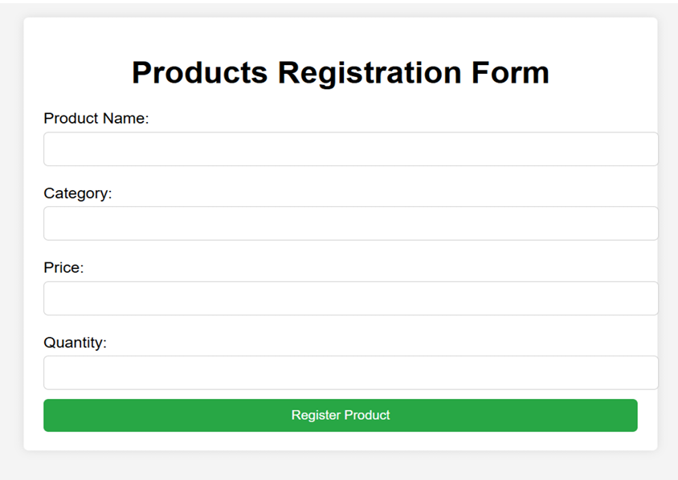
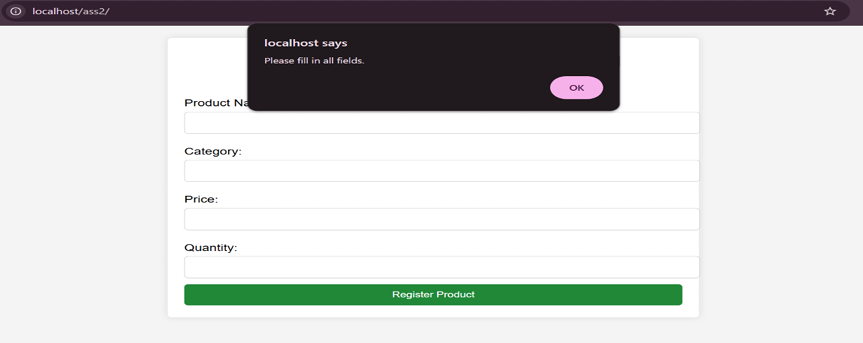
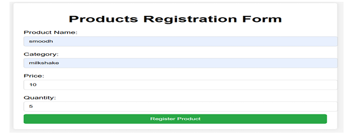
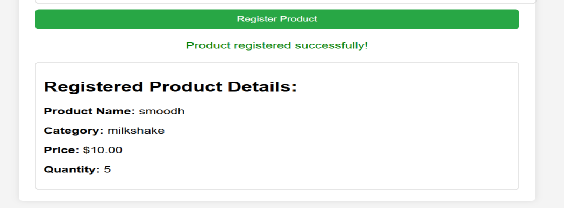

# ProdEase Entry System

A simple and functional product-registration web app built with **HTML, CSS, JavaScript, jQuery, and PHP**. 

Users can submit product details, validate inputs instantly, and view the formatted result on the same page. 

---

## Tech Badges


---

## 📌 Overview

ProdEase Entry System is a lightweight product registration interface with:

- Input validation  
- Error alert  
- Clean UI  
- Instant formatted display of product details  
- PHP backend handling  

Perfect for demonstrating front-end fundamentals and PHP form-processing flow.

---

## 🖼️ Screenshots

### 📍 Product Registration Form


### 📍  Empty Field Validation 


### 📍 Form Filled & Submitted 


### 📍 Formatted Output


---

## ⚙️ Features

- Responsive registration UI  
- Live input validation (JavaScript + jQuery)  
- PHP backend handling  
- Styled product-details output  
- Success message on submission  
- Clean and simple file structure  

---

## 🛠️ Tech Stack

| Layer | Tools |
|-------|-------|
| Frontend | HTML, CSS, JavaScript, jQuery |
| Backend | PHP |
| Hosting | PHP-supported platform |

---

## 📂 Project Structure

ProdEase-Entry-System/

│── index.html

│── script.js

│── style.css

│── submit.php

│── screenshots/

|__ README.md


---

## 🚀 Run Locally

1. Clone the repository:
   ```bash
   git clone https://github.com/pratheeksha2023/ProdEase-Entry-System
2. Place project inside XAMPP - htdocs folder or WAMP - www folder.
3. Start Apache.
4. Visit: http://localhost/ProdEase-Entry-System/

---
